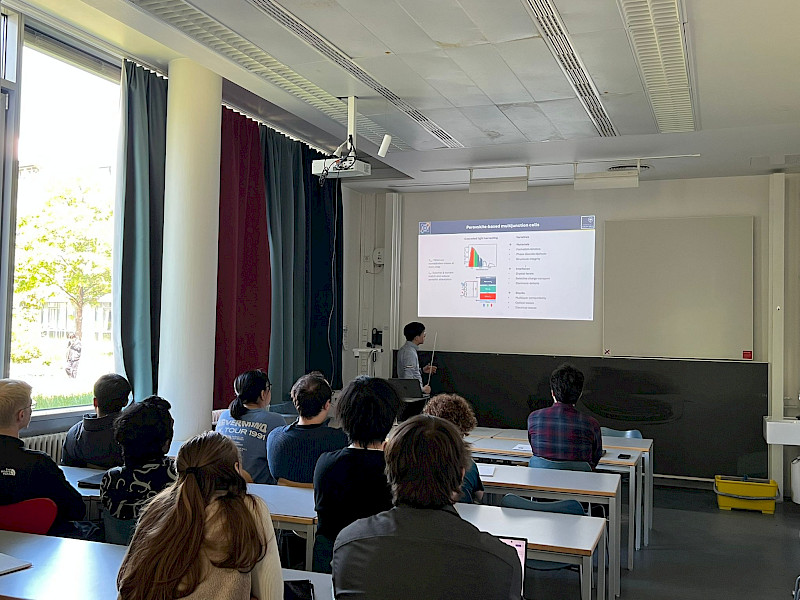
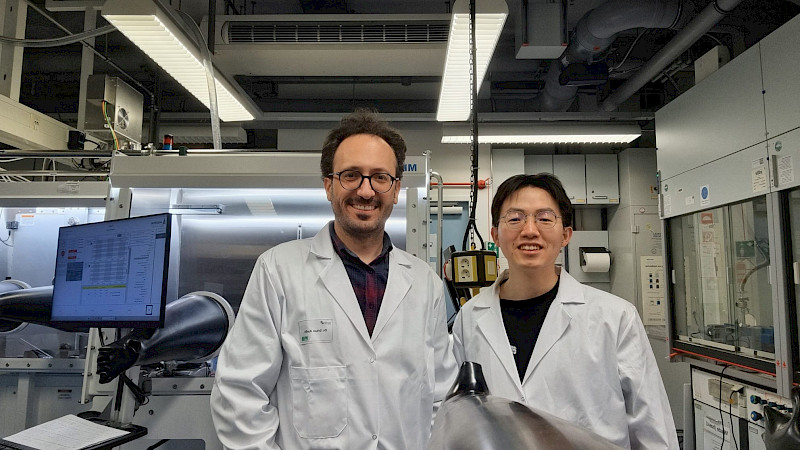

Junke Wang visited the [Aydin Group](https://aydin.cup.uni-muenchen.de/) at Ludwig Maximilian University of Munich (LMU Munich) as an invited speaker at their Solar Energy Seminar Series.

The talk, titled *Perovskite multijunction photovoltaics: materials, interfaces, and device platforms*, covered the fundamental challenges of morphological and compositional disorder in perovskite films and how these lead to open-circuit voltage losses and stability issues in high-bandgap solar cells. Mitigation strategies based on templated crystal growth were presented, achieving open-circuit voltages approaching 90% of the theoretical limit across bandgaps from 1.8 to 2.3 eV. The talk also demonstrated efficient monolithic all-perovskite double-, triple-, and quadruple-junction solar cells with power conversion efficiencies beyond 27% at 1 cm².

The presentation was followed by stimulating discussions with members of Prof. Aydin's group on interfacial engineering, long-term stability, and scalable deposition pathways. The visit also opened promising avenues for future collaboration, and we look forward to continued exchange.

We thank Prof. Erkan Aydin and his group for the warm welcome and the excellent scientific atmosphere. A summary of the visit has also been posted on the [Aydin Group website](https://aydin.cup.uni-muenchen.de/news/dr-junke-wang-visited-aydin-group-at-lmu-munich/).

