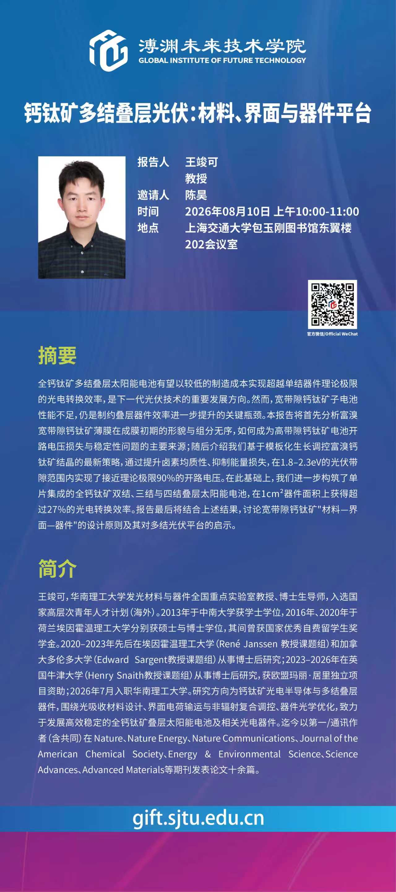

Junke Wang visited the Global Institute of Future Technology (GIFT) at Shanghai Jiao Tong University (SJTU) as an invited speaker, hosted by Prof. Hao Chen.

The talk, titled *Perovskite multijunction photovoltaics: materials, interfaces, and device platforms*, presented a broader perspective on the development of high-efficiency perovskite multijunction photovoltaics.

The seminar was followed by an engaging discussion on shared research interests and future collaboration. The visit was also a reunion with several former colleagues from the Sargent group who are now based at SJTU, and provided a welcome opportunity to reconnect and explore possibilities for future exchange between the two teams.

We thank Prof. Hao Chen and colleagues for the invitation and warm hospitality.

